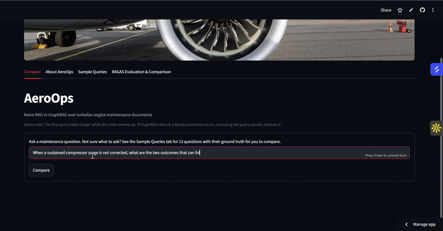
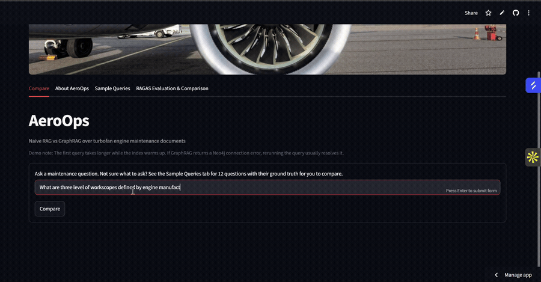
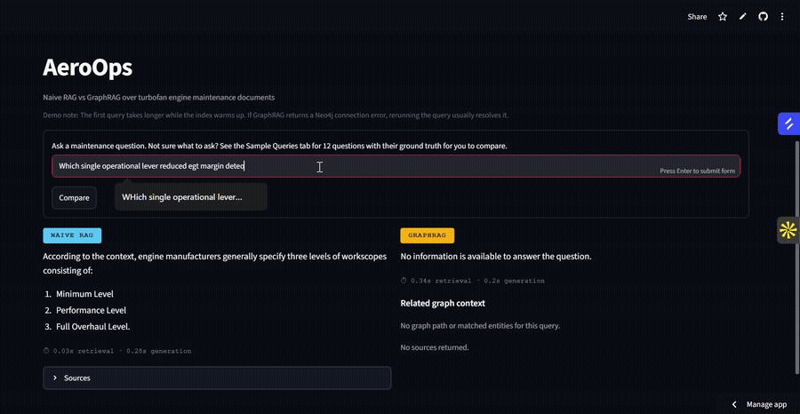

# AeroOps

**Does graph-structured retrieval actually beat flat-chunk retrieval on reasoning questions? I built both pipelines over the same turbofan maintenance corpus to find out.**

[**Live Demo**](https://aeroopsrag.streamlit.app) · [Source Documents](#knowledge-graph) · [Built by Palak Porwal](#built-by)

---

Both pipelines answer the same question side by side. Here's the case that made the whole experiment worth it:



**Naive RAG's answer is wrong, but it doesn't look wrong.** It reads as plausible, cites a real page, and RAGAS scores it as faithful. GraphRAG returns the correct outcomes (flameout, severe engine damage), each traced to its source chunk, with the causal path shown. This gap between confidently wrong and verifiably right doesn't show up in standard RAG metrics. More on that below.

## The experiment

Two retrieval architectures, same corpus, same generator, compared directly:

- **Naive RAG**: hybrid BM25 + FAISS vector retrieval over chunked PDF text
- **GraphRAG**: entity-typed knowledge graph (Neo4j) with path traversal, where every claim traces to its exact source chunk, page, and document

The corpus is 7 turbofan maintenance documents (NASA technical reports, FAA handbooks, operator guides). The questions are the kind a maintenance engineer would actually ask: causal chains, disambiguation between similar failure modes, "which source supports this claim."

## Three cases, three different outcomes

### Where naive RAG wins



*"What are the three levels of workscopes defined by engine manufacturers?"*

Single-hop lookup, answer sitting in one chunk. Naive RAG retrieves it cleanly. GraphRAG returns nothing, because no entity in the question matched a node in the graph. This is the honest failure mode of graph retrieval: if it isn't in the graph, it isn't answered, even when a flat retriever would have found it in the raw text.

### Where naive RAG gives up



*"Which single operational lever reduced EGT margin deterioration?"*

Naive RAG retrieves context but can't synthesize an answer from it, and says so. GraphRAG answers in one line, cited, with the causal path behind it: foreign object ingestion → compressor stall → rising EGT → mitigated by thrust reduction. Multi-hop questions are the case flat retrieval is structurally not built for.

### Where naive RAG is confidently wrong

The GIF at the top. This is the failure mode that matters most in a maintenance context: not a refusal you'd catch, but a plausible wrong answer you wouldn't.

## What's in the live demo


The [demo](https://aeroopsrag.streamlit.app) has four tabs:

- **Compare**: ask any maintenance question and get both pipelines' answers side by side, with retrieval and generation timings, sources, and the graph context GraphRAG walked to get there.
- **About AeroOps**: how the system works, plus the 7 source documents so you can check answers against the raw material.
- **Sample Queries**: 12 questions with their hand-verified ground truths. Pick any of them, run it through Compare, and judge both pipelines against the known answer yourself.
- **RAGAS Evaluation & Comparison**: the full metric breakdown, per-category scores, and the detailed analysis of where RAGAS undercounts graph-structured retrieval.

One note if you try it: the first query takes longer while the index warms up, and Groq's free tier occasionally rate-limits. Rerunning the query resolves both.

## What RAGAS misses

I ran RAGAS (faithfulness + context recall) as the standard benchmark. Naive RAG scored higher on both: faithfulness 0.71 vs 0.46, recall 0.94 vs 0.52.

I initially read this as GraphRAG underperforming. It isn't. The metric is measuring the wrong thing for this comparison. Faithfulness checks whether an answer is *supported by the retrieved context*, not whether it's *correct*. Naive RAG paraphrases whatever text sits closest to the question, so its answers are always well-grounded in their own retrieval, including the wrong ones. The compressor surge answer above scores as faithful because the wrong outcomes it lists really do appear in the retrieved chunk. Meanwhile GraphRAG's answers route through entity relationships, so they read as less "grounded" to an LLM judge even when they're more correct and fully traceable.

On reasoning-based questions, grounding and correctness split apart, and naive RAG's faithfulness score goes up exactly when its answers get worse. A detailed breakdown (flat-context-bag assumption, textual entailment vs. graph-verified truth, path-order blindness) is in the [evaluation section of the live demo](https://aeroopsrag.streamlit.app).

## Custom evaluation

Since RAGAS couldn't answer the question I was actually asking, I built a 35-item ground-truth set spanning 7 reasoning categories and scored GraphRAG against hand-verified answers:

| Category | Score |
|---|---|
| Multi-hop causal | 99% |
| Provenance | 77% |
| Single-hop factual | 71% |
| Aggregation / fan-out | 66% |
| Disambiguation | 66% |
| Operational scenarios | 53% |

The gradient is intentional. Harder categories score lower because the set was designed to stress-test the system, not flatter it. Multi-hop causal reasoning, the primary reason to use a graph at all, scores highest.

## Knowledge graph

Built from 7 source documents:

| Document | Type |
|---|---|
| Engine Maintenance Concepts for Financiers (Ackert) | Operator guide |
| Performance Deterioration of Commercial High-Bypass Ratio Turbofan Engines (NASA TM-81552) | Technical report |
| Airplane Turbofan Engine Operation and Malfunctions (FAA/Boeing) | Operations manual |
| Aircraft Turbine Engine Control Research at NASA Glenn Research Center | Technical report |
| AI for Turbofan Engines | Research paper |
| Fault Prognosis of Turbofan Engines | Research paper |
| Turbofan Engine Maintenance and Operation | Maintenance manual |

**267 nodes · 560 relationships · 12 entity types**: FailureMode, Symptom, Cause, Mitigation, Parameter, OperatingFactor, Method, Part, Module, Engine, Claim, Document. Every claim node links back to its exact source chunk and page.

## Stack

| Component | Technology |
|---|---|
| Knowledge graph | Neo4j AuraDB Free |
| Graph retrieval | Custom path traversal + star-pattern retrieval |
| Naive RAG retrieval | BM25 + FAISS (hybrid) |
| Embeddings | sentence-transformers/all-MiniLM-L6-v2 |
| Generation | Groq API (llama-3.1-8b-instant) |
| Frontend | Streamlit |
| Deployment | Streamlit Community Cloud |

## Project structure

```
app.py                      # Streamlit frontend
graph_rag.py                # GraphRAG pipeline wrapper
naive_rag.py                # Naive RAG pipeline
query_understanding_v3.py   # Deterministic entity router
graphretriever_v5.py        # Neo4j path traversal + star retrieval
context_builder.py          # Graph facts → LLM context
answer_generator_groq.py    # Groq generation
knowledgebase/              # 7 source PDFs
requirements.txt
packages.txt
```

## Local setup

```bash
git clone https://github.com/palakpwl07/AeroOps.git
cd AeroOps
python -m venv .venv && source .venv/bin/activate   # Windows: .venv\Scripts\activate
pip install -r requirements.txt
```

Create `.streamlit/secrets.toml`:

```toml
NEO4J_URI = "neo4j+s://your-instance.databases.neo4j.io"
NEO4J_USERNAME = "your-username"
NEO4J_PASSWORD = "your-password"
NEO4J_DATABASE = "your-database"
GROQ_API_KEY = "gsk_your-key"
```

```bash
streamlit run app.py
```

## Built by

**Palak Porwal**.

[LinkedIn](https://www.linkedin.com/in/palakporwal) · [Substack](https://substack.com)
